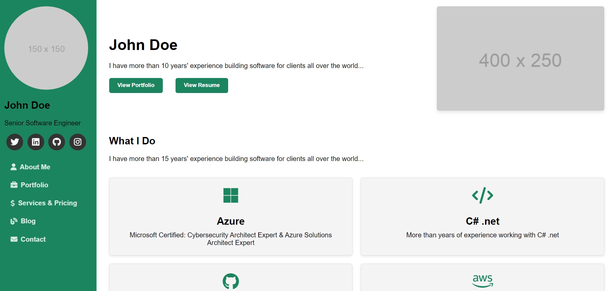

# My First Repo

This project is a one-page portfolio website showcasing my skills, projects, and articles. It's designed to highlight what I do, my portfolio, my articles, and includes a convenient left-side menu for easy navigation.

## Table of Contents

- [Introduction](#introduction)
- [Features](#features)
- [Getting Started](#getting-started)
  - [Prerequisites](#prerequisites)
  - [Installation](#installation)
- [Usage](#usage)
- [Security](#security)
- [Contributing](#contributing)
- [License](#license)


## Introduction

This portfolio website serves as a comprehensive showcase of my professional capabilities, including my work portfolio and insightful articles I've written. It's designed for potential employers, clients, and fellow professionals to quickly understand my expertise and project involvements.

<p align="center">
  
</p>

## Features

- **What I Do**: An overview of my professional services and skills.
- **My Portfolio**: A showcase of my completed projects.
- **My Articles**: A collection of articles I've written on industry-relevant topics.
- **Navigation**: Easy-to-use left-side menu for quick access to all sections of the portfolio.
- **Security Features**: Includes `.gitignore`, `SECURITY.md`, and `CODEOWNERS` files to maintain the project's integrity and security.
- **Code Quality**: Utilizes linters for JavaScript, CSS, and HTML to ensure code quality.
- **CI/CD**: Integrated with GitHub Actions for automated testing and deployment, hosted on GitHub Pages.

## Getting Started

### Prerequisites

- A modern web browser
- Basic understanding of HTML, CSS, and JavaScript

### Installation

Clone the repository to your local machine and the files from the chapter 10 folder:

```bash
git clone https://github.com/PacktPublishing/GitHub-for-Next-Generation-Coders.git
```

Navigate to the project directory:

cd myfirstrepo

Open the index.html file in your web browser to view the portfolio.

### Usage
-  Explore the sections to learn more about my professional background, view my projects, and read my articles. Use the left-side menu for easy navigation through the website.

### Security
-  Please refer to the SECURITY.md file for information on reporting security vulnerabilities.

### Contributing
-  Interested in contributing? Please read our contributing guidelines on how to propose enhancements or fix bugs.

### License
-  This project is licensed under the MIT License - see the LICENSE.md file for details.
