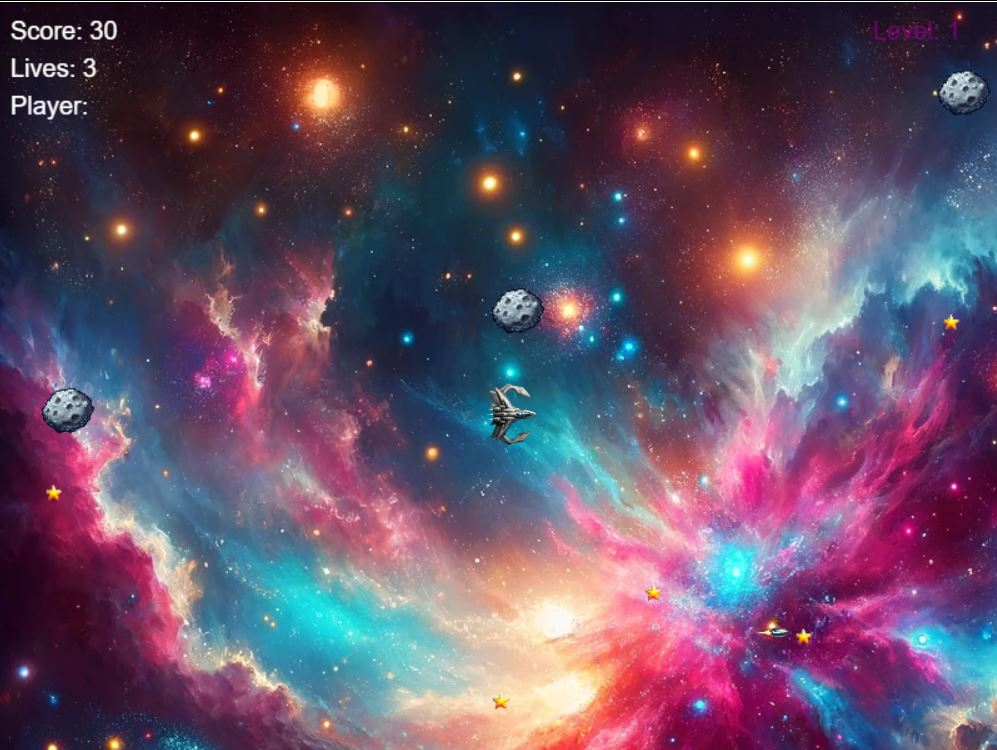

# Space Invaders Game

## Description

Space Invaders is an exciting and challenging shooting game set in space. Players navigate a spaceship, avoid obstacles, collect stars, and use various power-ups to survive and score as high as possible.

<p align="center">
  
</p>

## Features

- **Dynamic Obstacles**: Navigate through an ever-changing field of obstacles.
- **Collectible Stars**: Increase your score by collecting stars.
- **Power-Ups**: Gain advantages with speed, invincibility, and multi-shot power-ups.
- **Difficulty Levels**: The game gets progressively harder as your score increases.
- **High Score Tracking**: Keep track of your highest scores.
- **Responsive Design**: Playable on various devices and screen sizes.

## How to Play

1. Use arrow keys to move the spaceship.
2. Avoid colliding with obstacles.
3. Collect stars to increase your score.
4. Obtain power-ups to gain temporary advantages.
5. Press 'P' to pause the game.
6. Try to beat your high score!

## Installation

Clone the repository and open `Space Explorer Game/Game-final/index.html` in your browser to start playing:

```bash
git clone https://github.com/PacktPublishing/GitHub-for-Next-Generation-Coders.git
```

## Technologies Used

- **HTML5**: For structuring the game's content.
- **CSS3**: For styling the game's appearance.
- **JavaScript**: For implementing the game's logic and interactivity.

## Contributing

Contributions, issues, and feature requests are welcome! Feel free to check [issues page](https://github.com/PacktPublishing/GitHub-for-Next-Generation-Coders/issues).

## License

Distributed under the MIT License. See [LICENSE](https://github.com/PacktPublishing/GitHub-for-Next-Generation-Coders/blob/main/Space%20Explorer%20Game/Game-final/LICENSE) for more information.
